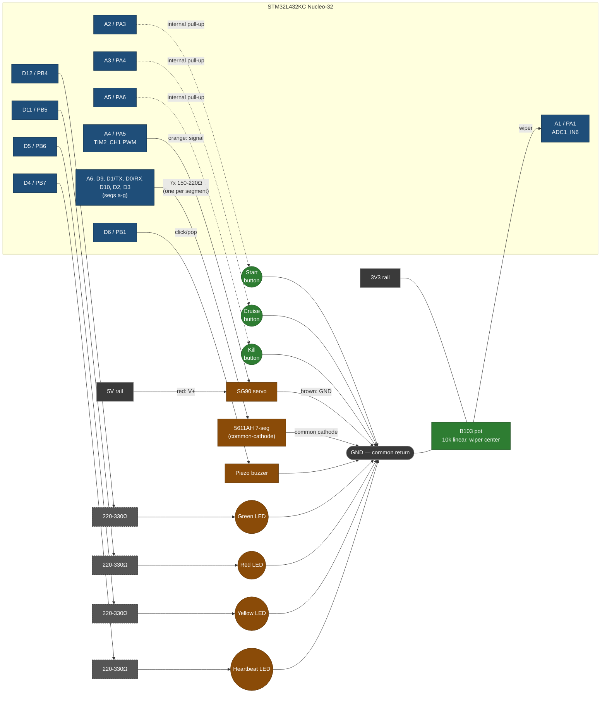

# Receiver bench schematic

No KiCad files yet (see `hardware/README.md` — that's where real schematics
will eventually live under CERN-OHL-S). This is a breadboard-level diagram
for the bench rig only, sufficient to wire it up; see `../docs/wiring.md`
for exact pin names and resistor values.

**Before wiring anything to `A4`/`A5`/`D4`/`D5`: cut solder bridges `SB16`
and `SB18` on the PCB.** They're closed by default on this board revision
and internally tie `PA6`↔`PB6` and `PA5`↔`PB7` together — see "Required
board mod" in `../docs/wiring.md` for the full explanation and how-to.

## Block diagram

Pin labels below are **Arduino header label / STM32 pin** — see
`../docs/wiring.md` for the full translation table and resistor-value
derivations. Renders natively on GitHub and in most Markdown viewers — no
extra software needed. (An ASCII version of this diagram lived here
previously; superseded by this Mermaid version, kept in git history if
ever needed.)



**Remove the factory spare jumper cap between GND and D2 first** — it's
not functional, just a parking spot ST ships a spare clip in, but D2
(PA12) is segment f here and the jumper would short it to ground. See
`../docs/wiring.md`.

**Deliberately unused** (reserved by the board — see `../docs/wiring.md`):
A0/PA0 (board-locked MCO/clock-in), A7/PA2 (ST-Link VCP_TX), PA13/PA14
(SWD, not on this header), PA15 (ST-Link VCP_RX, not on this header),
D13/PB3 (on-board green LED, LD3), D7/D8 (PC14/PC15, crystal). PB2 doesn't
exist on this package at all and has no Arduino label.

`[R]` = one current-limiting resistor per segment/LED (~220–330Ω, see
`../docs/wiring.md`). All GND connections (buttons, pot, display common if
cathode, buzzer, LEDs, servo) share one breadboard ground rail tied to the
Nucleo's GND.

## 7-segment segment layout (for reference)

```
        aaaa
       f    b
       f    b
        gggg
       e    c
       e    c
        dddd
```

`bench_app.c`'s `DIGIT_SEGMENTS` table encodes which of a–g light for each
digit 0–9; the decimal point is left unconnected (not used for a 0–9
readout).

## Servo power note

Route the SG90's V+ from the Nucleo's `5V` header pin (USB-derived), not
`3V3`. If the board resets when the servo moves under load, switch the
servo to a separate 5V supply and keep grounds common — see
`../docs/wiring.md`.

## Power rail note

The pot/display-common rail is `3V3`, not `VIN` (VIN is a power *input* for
an external battery/adapter, not a usable output while running on USB) and
not `5V` (the pot feeds the ADC directly, which is only rated to ~3.3V) —
see "Power rails: 3V3 vs 5V vs VIN" in `../docs/wiring.md` for the full
reasoning.
